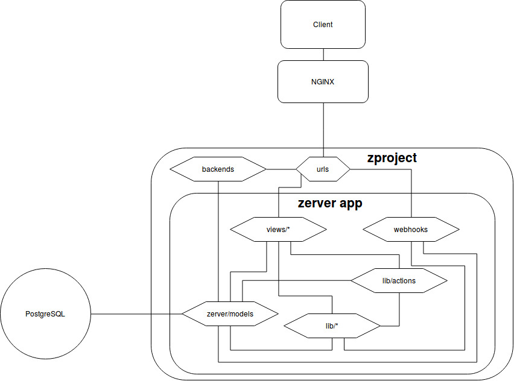

# Report for assignment 3

Repo with our code: https://github.com/DD2480-group7/zulip

## Project
* Name: Zulip
* URL: https://github.com/zulip/zulip
* Basically Slack but open source and with a email threading model. (Also LaTeX inline-support :heart:!)

## Architectural overview

### Key codebases
Zulip (https://github.com/zulip/zulip) is a web-based chat application. Zulip is based on the Django Python web framework and, thus, includes server-side code, web client and Python API bindings. There is also a version called Zulip Mobile, which supports both IOS and Android. This is written in Javascript and React Naive. Zulip Desktop works on macOS, Linux and Windows.[1]

Zulip also maintains: "a Hubot adapter; integrations with Phabricator, Jenkins, Puppet, Redmine, and Trello; node.js API bindings; and zulip’s full-text search PostgreSQL extension" as separate repos "for integrations and other glue code" and uses Transifex for translations.[1]

### Usage assumptions and concepts
Zulip is meant for groups from small teams to several hundred users. It is therefore catered to companies. It features "real-time notifications, message persistence and search, public group conversations (streams), invite-only streams, private one-on-one and group conversations, inline image previews, team presence/buddy lists, a rich API, Markdown message support, and numerous integrations with other services"[1]. 
Support is available to: "users who connect to Zulip using dedicated iOS, Android, Linux, Windows, and macOS clients, as well as people using modern web browsers or dedicated Zulip API clients"[1].

A person can be a user of several Zulip realms (organizations) since one server can host multiple realms. Each realm is private and the administrators of the realm choose wether to allow new users to register and join. Users may require an invitation to be able to join and administrators can restrict members of particular groups from joining, by email domain names or corporate single-sign-on login.

The Zulip “All messages” screen could be seen as an "inbox" which sums up messages that the user has missed, the most recent messages in all of the users joined streams which aren't muted, as well as private messages, starting at the oldest message.
A user can narrow to view only the messages in a single stream, and can further narrow to focus on a topic (thread) within that stream. Each narrow has its own URL. The user can quickly see what conversation they’re in – the stream and topic, or the names of the user(s) they’re private messaging with – using the recipient bar displayed atop each conversation.

According to Zulip their philosophy is to: "provide sensible defaults but give the user fine-grained control over their incoming information flow; a user can mute topics and streams, and can make fine-grained choices to reduce real-time notifications they find irrelevant"[1].

### Third party services (mentioned in subsystems documentation): 

A lot of third party applications are implemented in zulip to make everything run smoothly and increase functionality. These third party programs and services are also technically a part of the whole application architecture, but we have chosen to focus less on them:

* PostgreSQL
  * Database used for persistent data, aka. data that has a longer life time than the current session. 
* Redis
  * Used for short-term data storage. 
* Nginx
  * Front end web-server, provides Django and Tornado with assets to handle. 
* RabbitMQ
  * A queuing system which keeps track of requests that cannot be handled immidiately by the main thread due to congestion. 
* Django & Tornado
  * Django is a Python web framework which is zulip's main web application server. 
  * Tornado runs a server to client real time push system. It has the capacity of holiding open tens of thousands long-term connections. Responsible for message delivery. 
* HTML templates
  * Backend templates: Jinja 2
  * Frontend templates: Handlebars
* Supervisor
  * Starts and restarts server processes automatically if they crash. Also logs server data automatically. 
* Memcached
  * Used to cache database model objects instead of fetching data from the database itself for each request. Entries are invalidated if they have changed value in the original database. 
* Nagios
  * Used to send notifications to the system admin, for example in case of outages or downtime. Usually used as plugins run on a specific server. 
  
## Selected issue(s)
* Title: Clean up email_mirror code
* URL: https://github.com/zulip/zulip/issues/1836
* The issue entailed moving a couple of methods and changing so that when an error occured the method cast an exceptions instead of returning `None`. The changes, thus, also required modifications in calling methods in order to catch the error that was cast.

## Onboarding experience
Zulip is a very well documented project with a great community with helpful people.

To help with onboarding they have a ["Contributing to Zulip, getting started"-guide](https://zulip.readthedocs.io/en/latest/overview/contributing.html). The documentation contains everything from how to set up a development environment to how to run tests, what tests correspond to what parts of the code, code standards and extensive documentation for the different parts of the code. The prerequisite tools for the project were Git, Git for Windows (for windows users) Vagrant, Virtualbox, vagrant-lxc plugin (for linux users). The tools were well documented in the getting started-guide. Unfortunately there were errors depending on what operating system the contributor was using that the documentation had no answers to. When running “vagrant up” Vagrant downloaded the base Ubuntu 14.04 virtual machine image (for macOS and Windows) or container (for Ubuntu), configured this virtual machine/container for use with Zulip, created a shared directory mapping the clone of the Zulip code inside the virtual machine/container at ~/zulip and ran the tools/provision script inside the virtual machine/container, which downloads all required dependencies, sets up the python environment for the Zulip development server, and initializes a default test database. A [log](provision.log) from provisioning is included in this repository.

The onboarding experience as a windows user for the zulip-project was complicated and time-demanding since the current setup for windows is flawed and the documentation offered no support for the issue.
Two team members using windows had the issue of the Vagrantfile on line 35 checking the version of lxc-ls. Our guess is that the Vagrantfile isn’t supposed to be run for windows users.
To find the solution the “Troubleshooting and Common Errors” and “#provision help”-channel in zulip was studied, Git-BASH and Python was re-installed, the repo was re-cloned and windows permission-errors was examined.
Docker was also used to try to replace Vagrant but Docker required Windows Pro while the user had Windows Home.
The issue was finally resolved by one user commenting out line 35 and hard-coding the variable LXC_VERSION to 2.1.0. We have no confirmation of whether the zulip-team accepts this solution. 

For Mac users the experience of downloading and setting up the above mentioned tools was easy, and one could follow the guide step by step.  

For communications Zulip uses their own platform where they have a community server set up and where there always is someone that's able to help if you're stuck or having problems. We have used this a bit in order to get clarifications.

All in all this gives a very good base for great onboarding. It also sets a high standard for us as coders to follow the specified coding style and principles.

## **Functional Requirements**
The functional requirements are listed in compliance with the standard IEEE-830. The functional requirements related to the refactoring are those pertaining to the Email Gateway Integration. The requirements are structured at various degrees of granularity, descending into sub-sub requirements. The functionality targeted by the refactoring is requirement 1.1.1, while those prior serve to give an idea of the main functionality provided (and thus affected).
  
## **Related Functional requirements**
**Functional Requirement 1 - Email Gateway Integration**

**Description**
The System, Zulip, shall provide functionality for Email Gateway Integration. The Email gateway integration supports sending messages into Zulip by sending an email.  This is useful for receiving notifications from third-party services that only send outgoing notifications via email. Each stream has an email address documented on the stream settings page and emails sent to that address will be delivered into the stream.

**Degree of necessity**
Conditional

**Functional Requirement 1.1 -  Extract gateway message from address**
The system shall provide functionality for extracting gateway message from the email address used by the user to send a message to a Zulip chat stream. The gateway message is extracted from the address used in the input in the manner specified by the configurable setting EMAIL_GATEWAY_PATTERN.

**Degree of necessity**
Conditional

**Input**
Address:Text
The input consist of 1 argument which is the Address of the sender, in the format;   `<stream_name>+<token>@example.com` (as specified by EMAIL_GATEWAY_PATTERN).

**Output**
Optional[Text]

Optionally outputs the gateway message or an Exception.

## Requirements affected by functionality being refactored
**Functional Requirement 1.1.1- Throwing ZulipEmailUnrecognizedAddressError upon error/failure** 

The extraction of the gateway message shall throw an Exception, ZulipEmailUnrecognizedAddressError, when there’s no matching address found in the gateway message.

**Degree of necessity**

Optional

**Input**

Address:Text
The input consist of 1 argument which is the Address of the sender, in the format;   `<stream>+<token>@example.com` (as specified by EMAIL_GATEWAY_PATTERN).

**Output**

Exception, when no matching address in the extracted gateway message.

## Existing test cases relating to refactored code
When it comes to this refactoring problem it was important that all tests that existed when we started working on the code would still pass after our changes had been made. This meant that we had to make sure all dependencies were correct and that calling methods could handle the exception being raised. If we succeeded in this all existing test cases should pass just as before.

We focused on the tests in the test file zerver/tests/test_email_mirror.py since it was the file that tested the functionality of email_mirror.py. Even though the project states that they have a high code coverage, the tests are quite large; that is, they test different situations that can occur from a higher level rather than testing all the different cases of each method. Therefore, we kept these methods as they were, assuming that they covered what zulip considered important cases, and made sure that they still passed after the refactoring had been implemented. 

## Test cases relating to functional requirements
**Requirement 1**, the primary functional requirement for email gateway integration,has a dedicated testing suite located in the module zerver/lib/test_email_mirror.py. As such the sub requirements tests are also covered by the same module.

**Requirement 1.1** 
has test coverage which is fractionated among many tests (some not in the same module). Additionally we’ve been informed by the development team and project owner that requirement 1.1 (and by extension requirement 1) has incomplete test coverage. The combination of these has made us unable to locate all related tests in the vast code base, without the use of external code coverage tools.

**Requirement 1.1.1**
Has 8 newly added test cases:

#### `test_no_exception_get_email_gateway_message_string_from_address`
A standard positive test for when a correct address is passed into the method

#### `test_exception_get_get_email_gateway_message_string_from_address` 
A standard negative test for when a incorrect address is passed into the method

#### `test_allow_all_get_get_email_gateway_message_string_from_address`
Tests that the EMAIL_GATEWAY_EXTRA_PATTERN_HACK allows all host domains

#### `test_encode` 
Tests that the Address is correctly encoded

#### `test_encode_non_alphanumeric`
Tests that an Address that contains non alphanumeric characters is encoded correctly

#### `test_decode_is_encode_reverse`
Test that decode is encode in reverse

#### `test_decode_is_encode_reverse_google_group_workaround`
Test that decode is encode in reverse but with a google group workaround (which uses '.' instead of '+' in the domain name)

#### `test_decode_is_encode_reverse_non_alphanumeric`
Test that decode is encode in reverse when the Address is made up of non alphanumeric characters.

## The carried out refactoring

The following is a simplified UML-diagram over the classes and methods before and after they were affected by our refactoring. 

Since the affected classes are very large, fields and other unnessecary data has been omitted to give a clearer overview over what's been changed and how it affects each method. 

An asterix (*) after the method name implies that the specific method is called from a test case. 

We also looked at the later part of the issue related to catching exceptions and doing "useful" logging and error reporting. We carefully studied the code and deemed this part of the issue to be insufficiently defined. There were also further confusion since the code contained TODO-comments which we had questions about. To continue with this we would contact the zulip team further to ensured we fullfilled their vision.

## Updates in the source are put into context with the overall software architecture and discussed, relating them to design patterns and refactoring patterns.

The issue selected aimed at enhancing the health and cohesion of the code base by amending misplaced code. The code had partially inconsistent behavior (error handling) as in relation to the intended functionality of Email-mirroring/ Email gateway integration. As such this issue inherently pertains to the back-end of the application, specifically the application server implemented with Django. By looking at the figure for the architectural overview (provided by Zulip), we can say that the refactoring only affected one part of the backend, as it did not affect the realtime push server. However, it’s of note to mention that during the refactoring, an inconsistency was discovered in the front end web-server. The intended functionality for email integration is that each stream has an email address in it’s settings, however this is not the case and users need to access an external site to access a specific streams email. This refactoring issue being an old one (from 2016), it might now give raise to additional changes in the front-end web-server and additional refactoring in the back-end application server, if required.

In terms of refactoring patterns our refactoring used a technique for improving names and/or location of the code. Specifically the technique used was “move method or move field” where the targeted method(s) is moved to a more appropriate class or source file. Additionally one can say that we also used “Rename method or rename field” however we did not necessarily change a name as much as we created a new name for an Exception which was better suited for the error. The more advanced techniques such as for abstraction and breaking the code apart into more logical pieces  were not required for our refactoring.

## Test logs
Tests were executed and examined both before and after refactoring. To be completely thorough, we have both included the complete set of unit tests and those which are relevant to our changes. 

1.	[Complete test before refactoring](pre_test_output_all)
2.	[Relevant tests before refactoring](pre_test_output_relevant)
3.	[Complete test after refactoring](post_test_output_all)
4.	[Relevant tests after refactoring](post_test_output_relevant)

## Effort spent
*Alexander Manske*
1.  plenary discussions/meetings ≈ 2
2.  discussions within parts of the group ≈ 3
3.  reading documentation ≈ 8
4.  configuration ≈ 3
5.  analyzing code/output ≈ 3
6.  writing documentation ≈ 3
7.  writing code ≈ 2
8.  running code ≈ 6

*Alexander Viklund*
1.  plenary discussions/meetings incl. finding projects ≈ 2
2.  discussions within parts of the group  ≈ 2
3.  onboarding ≈ 4
4.  Setting up environment ≈ 5
5.  resolving dependency problems ≈ 4
6.  writing report  ≈ 4
7.  writing code ≈ 10
8.  running code ≈ 3

*Alfrida Mattisson*
1.  plenary discussions/meetings ≈ 2
2.  discussions within parts of the group ≈ 2
3.  reading documentation ≈ 5
4.  configuration ≈ 1
5.  analyzing code/output ≈ 4
6.  writing documentation ≈ 7
7.  writing code ≈ 8
8.  running code ≈ 1

*Hanna Nyblom*
1.  plenary discussions/meetings ≈ 2
2.  discussions within parts of the group ≈ 3
3.  reading documentation ≈ 3
4.  configuration ≈ 6
5.  analyzing code/output ≈ 5
6.  writing documentation ≈ 4
7.  writing code ≈ 3
8.  running code ≈ 3

*Lukas Szerszen*
1.  plenary discussions/meetings  ≈  2
2.  discussions within parts of the group; 5
3.  reading documentation  ≈  6
4.  configuration  ≈  3 (2hrs of bug fixing)
5.  analyzing code/output  ≈  4
6.  writing documentation  ≈  6
7.  writing code  ≈ 6
8.  running code  ≈  1

## Overall experience
The main take-aways for this project are an insight into the complexity of refactoring in a real-world open-source project.
Even if the given documentation/examples of the project were quite extensive, some members still experienced issues with the onboarding experience.
The community of the project seems to be fairly active, with contributers posting not only on the github issues but also daily in zulip channels like "#provision help". Our team even got the opportunity to post about our onboarding issues in this channel and potentially help future contributors. It was also interesting to see how the project was almost like a company with guides for almost everything imagineable and, for example, a code of conduct. Whatever you could think of, be it mocking tests, importing libraries or writing commit messages, there was a guide for it.

In addition to this we were in communication with the project owner, Tim Abbott, and the creator of the issue Steve Howell, who gave us some guidelines and answered our questions when we ran into them. As such we can first-hand state that we experienced the activity and passion of the Zulip project. 

## Benefits, drawbacks, and limitations of the work carried out
The outset and goal of this course is to be able to be a productive member of any software engineering project. With this project we've been able to actually put into practice what we’ve been learning in the course. To begin with the task of selecting an issue; while the issue in itself is only a refactoring issue, the principle of searching for open source projects and familizaring with the code base is a very integral skill to possess as a software engineer. Inherently this is a crucial skill as an open-source developer as one then has to take the responsibility to find work and contribute to it. Related to finding an open source are the nested skills of being versed in version control (Git and Github) and issue trackers, and perhaps code coverage as well. By having these skills one does not only become a productive software engineer but it also enables for value judgement. I.e by looking at the code base one can makes judgements based on the code coverage or on the structure, looking for signs of e.g. technical debt.  These skills then obviously com in hand when actually contributing to the code, this is where the understanding of Git, CI, Code coverage etc comes into practise. Zulip has been an excellent project to practise all of these aspects as it’s a big project with a dedicated and active community of developers.

Aside from the essential practical skills that this project has given us an opportunity to practise, there is also a social aspect to it. Part of being a productive member of a software project is to be able to work and communicate with its other members. Zulip has been a really good project in terms of communication as it has a dedicated developer community. Questions which arose during the project were posted in the developer Zulip chat, which also provide us a look into other issues being discussed and how the community functions. As such we have actually practised being part of a developer “team/community”, despite how being “just” a refactoring issue.

The limiting factor to our experience and the work we’ve done is naturally that we only did a refactoring. Work of this kind is beneficiary to the project as it reduces the technical debt, and can at times uncover other issues regarding code health. This issue did not really uncover that, however a sort of sub-issue did arise which was the the lines of code we were refactoring lacked complete test coverage. This enabled us to (in addition to the refactoring) to add additional tests which helped increased the code coverage. As such our work went outside the initial ramifications and provided with an additional (perhaps lasting) contribution to the project. 

Finally, the experience gained is that we are all more prepared to contribute to open-source projects with a familiarity to the process. We have also gained experience from interacting with the community of the project and working as a team to complete the assignment.

## Sources
[1] Zulip. 2018. Zulip architectural overview. Zulip. http://zulip.readthedocs.io/en/latest/overview/architecture-overview.html (February 20, 2018)
