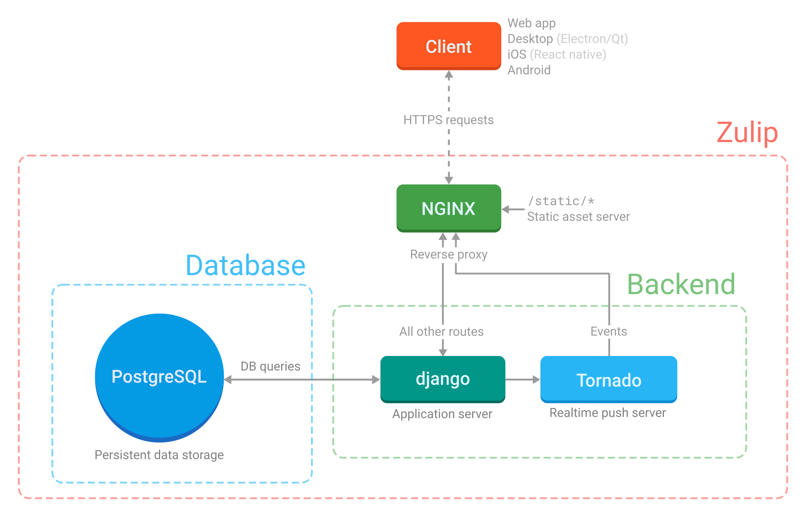

# Report for assignment 3

## Project
* Name: Zulip
* URL: https://github.com/zulip/zulip
* Basically Slack but open source and with a email threading model. (Also LaTeX inline-support :heart:!)

## Architectural overview

## Selected issue(s)
* Title: Clean up email_mirror code
* URL:https://github.com/zulip/zulip/issues/1836
* Move around some methods and change errors to cast exceptions instead of returning `None`. Requires modifications in calling methods.

## Onboarding experience
Zulip is a very well documented project with a great community with helpful people.

To help with onboarding they have a ["Contributing to Zulip, getting started"-guide](https://zulip.readthedocs.io/en/latest/overview/contributing.html). The documentation contains everything from how to set up a development environment to how to run tests, what tests correspond to what parts of the code, code standards and extensive documentation for the different parts of the code. The prerequisite tools for the project were Git, Git for Windows (for windows users) Vagrant, Virtualbox, vagrant-lxc plugin (for linux users). The tools were well documented in the getting started-guide. Unfortunately there were errors depending on what operating system the contributor was using that the documentation had no answers to. When running “vagrant up” Vagrant downloaded the base Ubuntu 14.04 virtual machine image (for macOS and Windows) or container (for Ubuntu), configured this virtual machine/container for use with Zulip, created a shared directory mapping the clone of the Zulip code inside the virtual machine/container at ~/zulip and ran the tools/provision script inside the virtual machine/container, which downloads all required dependencies, sets up the python environment for the Zulip development server, and initializes a default test database. A [log](provision.log) from provisioning is included in this repository.

The onboarding experience as a windows user for the zulip-project was complicated and time-demanding since the current setup for windows is flawed and the documentation offered no support for the issue.
Two team members using windows had the issue of the Vagrantfile on line 35 checking the version of lxc-ls. Our guess is that the Vagrantfile isn’t supposed to be run for windows users.
To find the solution the “Troubleshooting and Common Errors” and “#provision help”-channel in zulip was studied, Git-BASH and Python was re-installed, the repo was re-cloned and windows permission-errors was examined.
Docker was also used to try to replace Vagrant but Docker required Windows Pro while the user had Windows Home.
The issue was finally resolved by one user commenting out line 35 and hard-coding the variable LXC_VERSION to 2.1.0. We have no confirmation of whether the zulip-team accepts this solution.    

For communications Zulip uses their own platform where they have a community server set up and where there always is someone that's able to help if you're stuck or having problems.

All in all this gives a very good base for great onboarding. It also sets a high standard

### Third party services (mentioned in subsystems documentation): 
* PostgreSQL
  * Database for persistent data
* Redis
  * Used for short-term data stores
* Nginx
  * Front end web-server 
* RabbitMQ
  * Queuing system.
* Django & Tornado
  * Django: main web application server
  * Tornado: runs server to client real time push system
* HTML templates
  * Jinja 2: backend templates
  * Handlebars: frontend templates
* Supervisor
  * Starts and restarts server processes automatically if they crash.
* Memcached
  * Used to cache database model objects
* Nagios
  * Used for notifications to the system
  
## Requirements affected by functionality being refactored
Name(ID)
Title 
Description

### Req3:
*Requirements related to the functionality tageted by the refactoring:
(identified (by name(ID), title and description, and other optional attributes) and described in a systematic way)*

## Existing test cases relating to refactored code

## The refactoring carried out
(Link to) a UML diagram and its description

### Req7:
*Key features affected by the refactoring are shown in UML class diagrams (before/after).
Note: you do not have to show classes, fields, or methods that are not changed, unless they help with the overall understanding.*

## Test logs
Overall results with link to a copy of the logs (before/after
refactoring).
The refactoring itself is documented by the git log.

### Req5:
*Changes to the test suite are shown and documented, e.g. as a patch*

## Effort spent
*Alexander Manske*
1.  plenary discussions/meetings;
2.  discussions within parts of the group;
3.  reading documentation;
4.  configuration;
5.  analyzing code/output;
6.  writing documentation;
7.  writing code;
8.  running code?

*Alexander Viklund*
1.  plenary discussions/meetings;
2.  discussions within parts of the group;
3.  reading documentation;
4.  configuration;
5.  analyzing code/output;
6.  writing documentation;
7.  writing code;
8.  running code?

*Alfrida Mattisson*
1.  plenary discussions/meetings;
2.  discussions within parts of the group;
3.  reading documentation;
4.  configuration;
5.  analyzing code/output;
6.  writing documentation;
7.  writing code;
8.  running code?

*Hanna Nyblom*
1.  plenary discussions/meetings;
2.  discussions within parts of the group;
3.  reading documentation;
4.  configuration;
5.  analyzing code/output;
6.  writing documentation;
7.  writing code;
8.  running code?

*Lukas Szerszen*
1.  plenary discussions/meetings;
2.  discussions within parts of the group;
3.  reading documentation;
4.  configuration;
5.  analyzing code/output;
6.  writing documentation;
7.  writing code;
8.  running code?

## Overall experience
What are your main take-aways from this project? What did you learn?
Is there something special you want to mention here?

The main take-aways for this project are an insight into the complexity of refactoring in a real-world open-source project.
Even if the given documentation/examples of the project were quite extensive, some members still experienced issues with the onboarding experience.
The community of the project seems to be fairly active, with contributers posting not only on the github issues but also daily in zulip channels like "#provision help". Our team even got the opportunity to post about our onboarding issues in this channel and potentially help future contributors.

### Req8:
*The overall work carried out, and experience gained, are documented. In particular, mention your experience about
the given documentation/examples of the project,
its tool framework,
and the interaction within your team and with the community of the project.*
